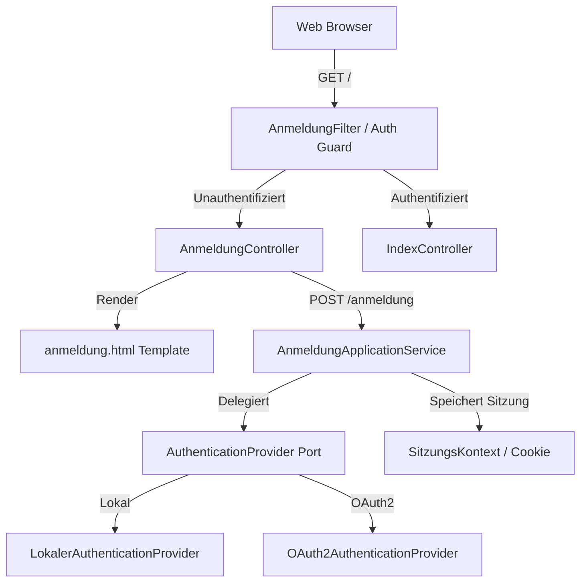

# Requirements

### Overview & Goals
Ziel ist die Umsetzung der Authentifizierungsspezifikation `spec/anmeldung.md`. Das System erfordert eine Anmeldung als Einstiegsseite, bevor auf das Verwaltungs-Dashboard zugegriffen werden kann. Die Lösung unterstützt die Benutzerrollen Ortswehrführer, Kamerad und Administrator und gewährleistet eine modulare, austauschbare Authentifizierungsarchitektur (lokal sowie OAuth2).

### Scope
- **In Scope:**
  - Anmeldeseite (`/anmeldung`) als Einstiegspunkt für unauthentifizierte Benutzer.
  - Formularbasierte Eingabe von Benutzername und Passwort mit "Anmelden (OK)" und "Abbrechen".
  - Clean Architecture Port- und Adapter-Design für austauschbare Authentifizierungsverfahren (NFR-1).
  - Lokaler Authentifizierungs-Provider mit Unterstützung verschiedener Rollen (`ORTSWEHRFUEHRER`, `KAMERAD`, `ADMINISTRATOR`).
  - Vorbereitung/Schnittstelle für OAuth2-Anbindung.
  - Saubere Fehlerbehandlung für ungültige Anmeldedaten, leere Pflichtfelder und nicht verfügbare Authentifizierungsdienste.
  - Anzeige des angemeldeten Benutzers und Logout-Möglichkeit im Layout (`base.html`).
- **Out of Scope:**
  - Externe Produktiv-Keycloak- oder Live-OAuth2-Server-Infrastruktur im aktuellen Build (wird als vorbereitete/konfigurierbare Provider-Struktur umgesetzt).
  - Persistente Datenbank-Benutzerverwaltung mit Registrierungs-Workflow (späterer separater Use Case).

### User Stories
- **US-1 (Benutzer-Login):** Als Kamerad, Ortswehrführer oder Administrator möchte ich mich mit meinen Anmeldedaten am System anmelden können, um auf das Feuerwehrverwaltungs-Dashboard zuzugreifen.
- **US-2 (Fehler-Feedback):** Als Benutzer möchte ich bei falschen Zugangsdaten, leeren Eingaben oder Service-Ausfällen eine verständliche Fehlermeldung erhalten, damit ich weiß, warum die Anmeldung fehlgeschlagen ist.
- **US-3 (Abbrechen):** Als Benutzer möchte ich eine angefangene Anmeldung abbrechen können, um die Eingabemaske zurückzusetzen.
- **US-4 (Abmelden):** Als angemeldeter Benutzer möchte ich mich sicher abmelden können, um den Zugriff auf meine Sitzung zu beenden.

### Functional Requirements
- **FR-1:** Das System erfordert eine Anmeldung als erste Webseite. Unauthentifizierte Anfragen auf die Root-URL (`/`) werden auf `/anmeldung` weitergeleitet. Nach erfolgreicher Anmeldung wird der Benutzer zur Startseite (`/`) weitergeleitet.
- **AC-1:** Anmeldemaske wird anstelle der Startseite angezeigt, wenn keine gültige Sitzung existiert.
- **AC-2:** Benutzername und Passwort können in der Maske eingegeben werden.
- **AC-3:** Anmeldung kann mit "OK" / "Anmelden" abgesendet oder mit "Abbrechen" verworfen werden.
- **AC-4:** Nach erfolgreicher Anmeldung wird das Dashboard (`/`) mit den Wehr-Daten angezeigt.
- **AC-5:** Nach fehlerhafter Anmeldung wird eine klare Fehlermeldung bzw. Fehlerseite angezeigt.
- **Randfälle:**
  - Leere Eingabemaske: Validierung im Application Service gibt konkretes Feedback ("Bitte Benutzername und Passwort angeben").
  - Nicht verfügbarer Dienst: Wenn der Authentifizierungsdienst offline ist, wird ein Fehlerhinweis ("Authentifizierungsdienst steht aktuell nicht zur Verfügung") gerendert.

### Non-Functional Requirements
- **NFR-1 (Wartbarkeit & Austauschbarkeit):** Das Anmeldeverfahren ist als Port (`AuthenticationProvider`) gekapselt und kann ohne Änderung der Controller oder Domäne ausgetauscht oder erweitert werden (lokal, OAuth2).
- **Clean Architecture & DDD:** Domänenobjekte sind mit jMolecules annotiert, Value Objects sind Java Records, Controller enthalten keinerlei Business-Logik.

# Technical Design

### Current Implementation
- Die Anwendung nutzt Quarkus 3.40 mit Qute Templates (`quarkus-rest-qute`), Java 21, jMolecules DDD und ArchUnit.
- Derzeit liefert `IndexController` auf `@GET /` direkt das Dashboard ohne Authentifizierungsprüfung aus.
- Es existiert bisher kein Session-Management oder Benutzerkontext im Application-Layer.

### Key Decisions
- **Port & Adapter für Authentifizierung:** Ein `AuthenticationProvider`-Interface im Application-Layer entkoppelt die Anwendungslogik von konkreten Authentifizierungsmechanismen.
- **Pluggable Provider:** `LokalerAuthenticationProvider` als Standard-Implementierung für lokale Benutzerkonten; `OAuth2AuthenticationProvider` als vorbereiteter Adapter zur Erfüllung von NFR-1.
- **Session-Handling:** Leichtgewichtiges Cookie-/Session-Handling via Quarkus Web-Adapter, gekapselt im `AnmeldungApplicationService`.
- **Einstiegs-Routing:** Automatische Weiterleitung (`Redirect`) von `/` zu `/anmeldung` für unauthentifizierte Anfragen, sodass bestehende Dashboard-URLs und Lesezeichen erhalten bleiben.

### Proposed Changes
1. **Domain Layer:**
   - `Benutzer`: Record (`@ValueObject`) mit Benutzername, Anzeigename und Rollen.
   - `Rolle`: Enum mit `ORTSWEHRFUEHRER`, `KAMERAD`, `ADMINISTRATOR`.
   - `AnmeldeCredentials`: Record (`@ValueObject`) für `benutzername` und `passwort`.
   - `AnmeldeErgebnis`: Record (`@ValueObject`) für Erfolgsstatus, Benutzer, Fehlermeldung und Verfügbarkeit.
2. **Application Layer:**
   - `AuthenticationProvider`: Port-Interface mit `authentifizieren(credentials)`, `isVerfuegbar()` und `getProviderTyp()`.
   - `LokalerAuthenticationProvider`: Provider für lokale Benutzerkonten mit Standardbenutzern.
   - `OAuth2AuthenticationProvider`: Provider für OAuth2-basierte Authentifizierung.
   - `AnmeldungApplicationService`: Orchestriert Authentifizierung, Validierung und Sitzungsverwaltung.
3. **Web Adapter Layer:**
   - `AnmeldungController`: Endpoints `@GET /anmeldung`, `@POST /anmeldung`, `@GET /abbrechen`, `@POST /abmelden`.
   - `AnmeldungFilter` / Auth-Guard: Leitet ungesicherte Dashboard-Zugriffe um.
   - Qute-Templates: `src/main/resources/templates/anmeldung.html`, Erweiterung von `base.html` (User-Status & Logout-Button).

### Data Models & Contracts
```java
@ValueObject
public record AnmeldeCredentials(String benutzername, String passwort) {}

@ValueObject
public record Benutzer(String benutzername, String anzeigeName, Set<Rolle> rollen) {}

public enum Rolle {
  ORTSWEHRFUEHRER, KAMERAD, ADMINISTRATOR
}

@ValueObject
public record AnmeldeErgebnis(
    boolean erfolgreich,
    Benutzer benutzer,
    String fehlermeldung,
    boolean serviceVerfuegbar
) {}

public interface AuthenticationProvider {
  AnmeldeErgebnis authentifizieren(AnmeldeCredentials credentials);
  boolean isVerfuegbar();
  String getProviderTyp();
}
```

### Architecture Diagram


### File Structure
- `src/main/java/de/eichstaedt/ortswehrfuehrer/domain/`
  - `Benutzer.java` (neu)
  - `Rolle.java` (neu)
  - `AnmeldeCredentials.java` (neu)
  - `AnmeldeErgebnis.java` (neu)
- `src/main/java/de/eichstaedt/ortswehrfuehrer/application/`
  - `AuthenticationProvider.java` (neu, Port)
  - `LokalerAuthenticationProvider.java` (neu)
  - `OAuth2AuthenticationProvider.java` (neu)
  - `AnmeldungApplicationService.java` (neu)
- `src/main/java/de/eichstaedt/ortswehrfuehrer/adapter/web/`
  - `AnmeldungController.java` (neu)
  - `AnmeldungFilter.java` (neu)
  - `IndexController.java` (angepasst für Session-Kontext)
- `src/main/resources/templates/`
  - `anmeldung.html` (neu)
  - `base.html` (angepasst: Anzeige angemeldeter Benutzer & Logout)

### Risks & Mitigations
- **Risiko: Zirkuläre Weiterleitungen bei Auth-Filtern:**
  - *Mitigation:* Explizite Whitelist für `/anmeldung`, statische Assets und Health-Checks im Filter.
- **Risiko: Verletzung von jMolecules DDD / Clean Architecture Regeln:**
  - *Mitigation:* Alle neuen Domänenklassen werden explizit als `@ValueObject` Records angelegt und in `ArchitectureTest` automatisiert geprüft.

# Testing

### Validation Approach
Die Validierung erfolgt mehrschichtig:
1. **Unit-Tests**: Isolierte Prüfung von Value Objects, Anmeldevalidierung, Providern und dem `AnmeldungApplicationService`.
2. **Web-Adapter- & Integrationstests**: End-to-End-Prüfung der Controller-Endpunkte mit REST-Assured (`AnmeldungControllerTest`, `IndexControllerTest`).
3. **Architekturprüfungen**: ArchUnit-Tests (`ArchitectureTest`) zur Sicherstellung von DDD-Konformität und Clean-Architecture-Vorgaben.

### Key Scenarios
- **Szenario 1: Erfolgreiche Anmeldung Ortswehrführer**
  - Aufruf von `/` ohne Session -> Weiterleitung zu `/anmeldung`.
  - POST `/anmeldung` mit gültigen Ortswehrführer-Credentials.
  - Erwartetes Ergebnis: Weiterleitung zu `/` mit Session-Cookie, Dashboard wird angezeigt, Benutzername & Rolle im Header sichtbar.
- **Szenario 2: Fehlgeschlagene Anmeldung (ungültige Anmeldedaten)**
  - POST `/anmeldung` mit falschem Passwort.
  - Erwartetes Ergebnis: Weiterleitung oder Anzeige von `/anmeldung` mit Fehlermeldung "Ungültige Anmeldedaten".
- **Szenario 3: Randfall Leere Eingabemaske**
  - POST `/anmeldung` mit leeren Feldern.
  - Erwartetes Ergebnis: Fehlermeldung "Benutzername und Passwort sind erforderlich".
- **Szenario 4: Randfall Authentifizierungsdienst nicht verfügbar**
  - POST `/anmeldung` bei simuliertem Provider-Ausfall (`isVerfuegbar() == false`).
  - Erwartetes Ergebnis: Fehlermeldung "Authentifizierungsdienst steht aktuell nicht zur Verfügung".
- **Szenario 5: Abbrechen der Anmeldung**
  - Klick auf "Abbrechen" auf der Anmeldeseite.
  - Erwartetes Ergebnis: Formular wird zurückgesetzt / Weiterleitung auf saubere `/anmeldung`.
- **Szenario 6: Abmelden (Logout)**
  - Aufruf von POST `/abmelden` als angemeldeter Benutzer.
  - Erwartetes Ergebnis: Session wird invalidiert, Weiterleitung zu `/anmeldung`.

### Test Changes
- `src/test/java/de/eichstaedt/ortswehrfuehrer/domain/BenutzerTest.java` (neu)
- `src/test/java/de/eichstaedt/ortswehrfuehrer/application/AnmeldungApplicationServiceTest.java` (neu)
- `src/test/java/de/eichstaedt/ortswehrfuehrer/application/LokalerAuthenticationProviderTest.java` (neu)
- `src/test/java/de/eichstaedt/ortswehrfuehrer/adapter/web/AnmeldungControllerTest.java` (neu)
- `src/test/java/de/eichstaedt/ortswehrfuehrer/ArchitectureTest.java` (Validierung aller neuen Klassen)

# Delivery Steps

### ✓ Step 1: Domänenmodell und Authentifizierungs-Port erstellen
Das Domänenmodell und die Kern-Ports für die Authentifizierung sind implementiert und durch Unit-Tests abgesichert.

- Value Object `@ValueObject public record AnmeldeCredentials(String benutzername, String passwort)` erstellen.
- Value Object `@ValueObject public record AnmeldeErgebnis(boolean erfolgreich, Benutzer benutzer, String fehlermeldung, boolean serviceVerfuegbar)` erstellen.
- Value Object / Entity `@ValueObject public record Benutzer(String benutzername, String anzeigeName, Set<Rolle> rollen)` erstellen.
- Enum `Rolle` (`ORTSWEHRFUEHRER`, `KAMERAD`, `ADMINISTRATOR`) definieren.
- Port-Schnittstelle `AuthenticationProvider` im Application-Layer mit Methoden `authentifizieren(AnmeldeCredentials credentials)`, `isVerfuegbar()` und `getProviderTyp()` definieren.
- Unit-Tests für alle neuen Domänenobjekte und Value Objects in `src/test/java/.../domain/` erstellen.

### ✓ Step 2: Application Service und Authentifizierungs-Provider implementieren
Die Anwendungslogik für die Authentifizierung sowie austauschbare Provider für lokale Credentials und OAuth2 sind bereitgestellt.

- `LokalerAuthenticationProvider` mit konfigurierbaren Standardbenutzern (Ortswehrführer, Kamerad, Administrator) und Validierung implementieren.
- `OAuth2AuthenticationProvider`-Struktur als austauschbaren Provider gemäß NFR-1 implementieren.
- `AnmeldungApplicationService` `@Service @ApplicationScoped` implementieren: Kapselt die Auswertung von Anmeldeversuchen, Fehlerbehandlung bei leeren Feldern / Offline-Providern, Session-Zustand und Logout.
- `SitzungsKontext` / Session-Management zur Verwaltung des angemeldeten Benutzers bereitstellen.
- Umfassende Unit-Tests in `AnmeldungApplicationServiceTest` und Provider-Tests erstellen.

### ✓ Step 3: Web-Adapter, Templates und Session-Routing umsetzen
Web-Controller, Login-Maske, Fehlerbehandlung und Weiterleitungslogik sind vollständig funktionsfähig.

- `AnmeldungController` `@Path("/anmeldung")` implementieren (Rendern der Anmeldemaske via Qute, Verarbeiten von Login-POST, Abbrechen-Aktion und Logout).
- Qute-Template `src/main/resources/templates/anmeldung.html` mit Bootstrap-5-Formular (Benutzername, Passwort, OK/Anmelden-Button, Abbrechen-Button, Fehlermeldungs-Alerts) erstellen.
- Anmelde-Prüfung / Weiterleitung (ContainerRequestFilter oder Controller-Check) für unauthentifizierte Zugriffe auf das Dashboard (`/`) etablieren.
- Navigationsleiste in `base.html` um Anzeige des angemeldeten Benutzers und Abmelden-Aktion erweitern.
- Controller- und Web-Tests in `AnmeldungControllerTest` implementieren.

### ✓ Step 4: Ganzheitliche Validierung, Architektur- und Regressionstests
Alle Akzeptanzkriterien, Randfälle, Architekturregeln und Regressionstests sind validiert und erfolgreich.

- End-to-End- und Controller-Integrationstests für alle Akzeptanzkriterien (AC-1 bis AC-5) und Randfälle (leere Eingaben, Provider nicht verfügbar) schreiben.
- Sicherstellen der Einhaltung aller ArchUnit- und jMolecules-Regeln in `ArchitectureTest`.
- Testausführung über `./mvnw test` und Verifikation der 100%igen Test-Pass-Rate und Code-Coverage.