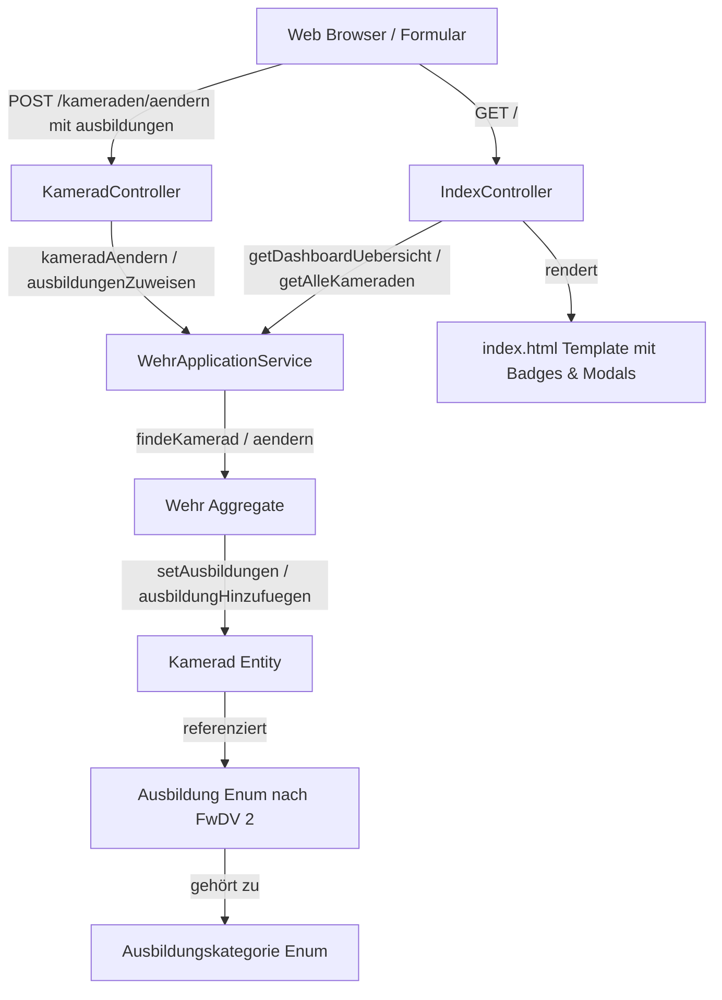

# Requirements

### Overview & Goals
Ziel ist die vollständige Implementierung der Ausbildungs- und Qualifikationsverwaltung für Feuerwehrangehörige (Kameraden) nach der **Feuerwehr-Dienstvorschrift 2 (FwDV 2: Ausbildung der Freiwilligen Feuerwehren)** im Projekt [ortswehrfuehrer](air-folder://snpojiod4krhmm4aipea/Users/konrad/Sourcecode/ortswehrfuehrer?type=folder&root=%252F).

Ortswehrführer müssen in der Lage sein, Kameraden absolvierte Ausbildungen nach FwDV 2 zuzuweisen, diese in der Übersicht übersichtlich anzuzeigen und bei Bedarf wieder zu entfernen.

### Scope
- **In Scope:**
  - Domänenmodellierung aller Ausbildungen und Lehrgänge gemäß [fwdv_2.pdf](air-file://snpojiod4krhmm4aipea/Users/konrad/Sourcecode/ortswehrfuehrer/spec/fwdv_2.pdf?type=file&root=%252F) (Truppausbildung, Technische Ausbildung, Führungsausbildung, Fortbildung).
  - Zuordnung von Ausbildungen zu [Kamerad.java](air-file://snpojiod4krhmm4aipea/Users/konrad/Sourcecode/ortswehrfuehrer/src/main/java/de/eichstaedt/ortswehrfuehrer/domain/Kamerad.java?type=file&root=%252F) im Aggregat [Wehr.java](air-file://snpojiod4krhmm4aipea/Users/konrad/Sourcecode/ortswehrfuehrer/src/main/java/de/eichstaedt/ortswehrfuehrer/domain/Wehr.java?type=file&root=%252F).
  - Orchestrierung in [WehrApplicationService.java](air-file://snpojiod4krhmm4aipea/Users/konrad/Sourcecode/ortswehrfuehrer/src/main/java/de/eichstaedt/ortswehrfuehrer/application/WehrApplicationService.java?type=file&root=%252F).
  - Formularverarbeitung im [KameradController.java](air-file://snpojiod4krhmm4aipea/Users/konrad/Sourcecode/ortswehrfuehrer/src/main/java/de/eichstaedt/ortswehrfuehrer/adapter/web/KameradController.java?type=file&root=%252F).
  - UI-Erweiterung in [index.html](air-file://snpojiod4krhmm4aipea/Users/konrad/Sourcecode/ortswehrfuehrer/src/main/resources/templates/index.html?type=file&root=%252F) (Tabelle und Modals für Bearbeitung/Neuaufnahme).
  - Automatische Tests (Unit-, Architektur- und Web-Integrationstests).
- **Out of Scope:**
  - Durchführung oder Prüfungsabnahme von Lehrgängen (diese erfolgen an feuerwehrtechnischen Zentren oder Landesfeuerwehrschulen, siehe [ausbildung.md](air-file://snpojiod4krhmm4aipea/Users/konrad/Sourcecode/ortswehrfuehrer/spec/ausbildung.md?type=file&root=%252F)).
  - Zertifikatsgenerierung oder Dokumenten-Upload.

### User Stories
- **Als Ortswehrführer** möchte ich einem Kameraden in der Bearbeitungsmaske mehrere absolvierte Ausbildungen nach FwDV 2 zuweisen können, damit die Qualifikationen des Kameraden im System gepflegt sind.
- **Als Ortswehrführer** möchte ich die absolvierten Ausbildungen aller Kameraden auf der Kameraden-Übersicht auf einen Blick sehen, um die Einsatzbereitschaft und Fähigkeiten meiner Wehr schnell beurteilen zu können.
- **Als Ortswehrführer** möchte ich zugewiesene Ausbildungen auch wieder entfernen können, falls Fehleingaben korrigiert werden müssen.

### Functional Requirements
- **FR-1 (Ausbildungszuweisung):** Zuweisung von Ausbildungen nach FwDV 2 zu einem Kameraden.
  - **AC-1 (FR-1):** Die Bearbeitungsmaske des Kameraden enthält eine Möglichkeit, mehrere Ausbildungen zuzuweisen (strukturiert nach Kategorien: Truppausbildung, Technische Ausbildung, Führungsausbildung, Fortbildung).
  - **AC-2 (FR-1):** Die Ausbildungen werden auf der Übersicht der Kameraden in der Tabelle dargestellt (z. B. mit Badges / Kurzbezeichnungen).
  - **AC-3 (FR-1):** Eine zugewiesene Ausbildung kann in der Bearbeitungsmaske wieder abgewählt/entfernt werden.

### Non-Functional Requirements
- **DDD & Clean Architecture:** Vollständige Einhaltung von Domain-Driven Design (jMolecules-Annotationen) und Clean Architecture (keine Geschäftslogik in Controllern).
- **Java 21 & Quarkus:** Verwendung moderner Java-Features (Records für Value Objects, Enums, Streams, Pattern Matching) und Quarkus Qute Templates.
- **Architekturkonsistenz:** Alle ArchUnit-Regeln in [ArchitectureTest.java](air-file://snpojiod4krhmm4aipea/Users/konrad/Sourcecode/ortswehrfuehrer/src/test/java/de/eichstaedt/ortswehrfuehrer/ArchitectureTest.java?type=file&root=%252F) müssen grün sein.

# Technical Design

### Current Implementation
- Die Entität [Kamerad.java](air-file://snpojiod4krhmm4aipea/Users/konrad/Sourcecode/ortswehrfuehrer/src/main/java/de/eichstaedt/ortswehrfuehrer/domain/Kamerad.java?type=file&root=%252F) verwaltet persönliche Stammdaten (Name, Geburtsdatum, Adresse, Telefonnummer, E-Mail), besitzt aber noch kein Attribut für Ausbildungen oder Qualifikationen.
- Das Aggregat [Wehr.java](air-file://snpojiod4krhmm4aipea/Users/konrad/Sourcecode/ortswehrfuehrer/src/main/java/de/eichstaedt/ortswehrfuehrer/domain/Wehr.java?type=file&root=%252F) hält die Abteilungen (Jugend, Einsatz, Alters- und Ehrenabteilung) und delegiert Aktionen an Kameraden.
- Der [WehrApplicationService.java](air-file://snpojiod4krhmm4aipea/Users/konrad/Sourcecode/ortswehrfuehrer/src/main/java/de/eichstaedt/ortswehrfuehrer/application/WehrApplicationService.java?type=file&root=%252F) steuert Use-Cases und initialisiert Standard-Testdaten.
- Der [KameradController.java](air-file://snpojiod4krhmm4aipea/Users/konrad/Sourcecode/ortswehrfuehrer/src/main/java/de/eichstaedt/ortswehrfuehrer/adapter/web/KameradController.java?type=file&root=%252F) nimmt Formular-POST-Requests entgegen und leitet auf die Startseite weiter.
- Das Template [index.html](air-file://snpojiod4krhmm4aipea/Users/konrad/Sourcecode/ortswehrfuehrer/src/main/resources/templates/index.html?type=file&root=%252F) rendert die Übersicht und die Modals zur Bearbeitung.

### Key Decisions
1. **Domänenrepräsentation der FwDV 2 Lehrgänge via Enum `Ausbildung`:**
   - *Entscheidung:* Alle in [fwdv_2.pdf](air-file://snpojiod4krhmm4aipea/Users/konrad/Sourcecode/ortswehrfuehrer/spec/fwdv_2.pdf?type=file&root=%252F) genormten Lehrgänge werden als Enum `Ausbildung` (im Package `de.eichstaedt.ortswehrfuehrer.domain`) abgebildet, analog zu `Fahrzeugtyp` für DIN 14530.
   - *Attribute:* Ziffer (z. B. "2.1.1", "3.2"), Bezeichnung ("Atemschutzgeräteträger"), Mindeststundenzahl (z. B. 25) und `Ausbildungskategorie`.
2. **Kamerad als Aggregat-Bestandteil mit `Set<Ausbildung>`:**
   - *Entscheidung:* Ein Kamerad speichert seine Ausbildungen in einem `Set<Ausbildung> ausbildungen` (standardmäßig `LinkedHashSet` für deterministische Reihenfolge).
   - *Rationale:* Ein Kamerad kann jede Ausbildung maximal einmal besitzen; Set verhindert Duplikate.
3. **Erweiterung von `Kamerad.Builder` und `aendern()`:**
   - *Entscheidung:* Builder und `aendern()`-Methode erhalten Überladungen bzw. Erweiterungen für Ausbildungen.
4. **Formularverarbeitung im Controller:**
   - *Entscheidung:* Der Controller nimmt `@FormParam("ausbildungen") List<String> ausbildungen` entgegen und konvertiert String-Namen sicher in Enum-Werte.

### Data Models / Contracts

```java
package de.eichstaedt.ortswehrfuehrer.domain;

public enum Ausbildungskategorie {
  TRUPPAUSBILDUNG("Truppausbildung"),
  TECHNISCHE_AUSBILDUNG("Technische Ausbildung"),
  FUEHRUNGSAUSBILDUNG("Führungsausbildung"),
  FORTBILDUNG("Fortbildung");

  private final String bezeichnung;
  // Konstruktor & Getter
}
```

```java
package de.eichstaedt.ortswehrfuehrer.domain;

public enum Ausbildung {
  // 2 Truppausbildung
  TRUPPMANN_TEIL_1("2.1.1", "Truppmann Teil 1 (Grundausbildungslehrgang)", 70, Ausbildungskategorie.TRUPPAUSBILDUNG),
  TRUPPMANN_TEIL_2("2.1.2", "Truppmann Teil 2", 80, Ausbildungskategorie.TRUPPAUSBILDUNG),
  TRUPPFUEHRER("2.2", "Truppführer", 35, Ausbildungskategorie.TRUPPAUSBILDUNG),

  // 3 Technische Ausbildung
  SPRECHFUNKER("3.1", "Sprechfunker", 16, Ausbildungskategorie.TECHNISCHE_AUSBILDUNG),
  ATEMSCHUTZGERAETETRAEGER("3.2", "Atemschutzgeräteträger", 25, Ausbildungskategorie.TECHNISCHE_AUSBILDUNG),
  MASCHINIST("3.3", "Maschinist", 35, Ausbildungskategorie.TECHNISCHE_AUSBILDUNG),
  TECHNISCHE_HILFELEISTUNG("3.4", "Technische Hilfeleistung", 35, Ausbildungskategorie.TECHNISCHE_AUSBILDUNG),
  ABC_EINSATZ("3.5", "ABC-Einsatz", 70, Ausbildungskategorie.TECHNISCHE_AUSBILDUNG),
  ABC_ERKUNDUNG("3.6", "ABC-Erkundung", 35, Ausbildungskategorie.TECHNISCHE_AUSBILDUNG),
  ABC_DEKONTAMINATION_P_G("3.7", "ABC-Dekontamination P/G", 28, Ausbildungskategorie.TECHNISCHE_AUSBILDUNG),
  GERAETEWART("3.8", "Gerätewart", 35, Ausbildungskategorie.TECHNISCHE_AUSBILDUNG),
  ATEMSCHUTZGERAETEWART("3.9", "Atemschutzgerätewart", 35, Ausbildungskategorie.TECHNISCHE_AUSBILDUNG),

  // 4 Führungsausbildung
  GRUPPENFUEHRER("4.1", "Gruppenführer", 70, Ausbildungskategorie.FUEHRUNGSAUSBILDUNG),
  ZUGFUEHRER("4.2", "Zugführer", 70, Ausbildungskategorie.FUEHRUNGSAUSBILDUNG),
  VERBANDSFUEHRER("4.3", "Verbandsführer", 35, Ausbildungskategorie.FUEHRUNGSAUSBILDUNG),
  EINFUEHRUNG_IN_DIE_STABSARBEIT("4.4", "Einführung in die Stabsarbeit", 35, Ausbildungskategorie.FUEHRUNGSAUSBILDUNG),
  FUEHREN_IM_ABC_EINSATZ("4.5", "Führen im ABC-Einsatz", 35, Ausbildungskategorie.FUEHRUNGSAUSBILDUNG),
  LEITER_EINER_FEUERWEHR("4.6", "Leiter einer Feuerwehr", 35, Ausbildungskategorie.FUEHRUNGSAUSBILDUNG),
  AUSBILDER_IN_DER_FEUERWEHR("4.7", "Ausbilder in der Feuerwehr", 35, Ausbildungskategorie.FUEHRUNGSAUSBILDUNG),

  // 5 Fortbildung
  FORTBILDUNG("5", "Fortbildung", 0, Ausbildungskategorie.FORTBILDUNG);

  private final String ziffer;
  private final String bezeichnung;
  private final int mindeststunden;
  private final Ausbildungskategorie kategorie;
  // Konstruktor, Getter, Helper-Methoden wie findeNachZiffer(...)
}
```

### Architecture Diagram



### File Structure Changes
- **Neu angelegt:**
  - `src/main/java/de/eichstaedt/ortswehrfuehrer/domain/Ausbildung.java`
  - `src/main/java/de/eichstaedt/ortswehrfuehrer/domain/Ausbildungskategorie.java`
  - `src/test/java/de/eichstaedt/ortswehrfuehrer/domain/AusbildungFwdv2Test.java`
- **Modifiziert:**
  - [Kamerad.java](air-file://snpojiod4krhmm4aipea/Users/konrad/Sourcecode/ortswehrfuehrer/src/main/java/de/eichstaedt/ortswehrfuehrer/domain/Kamerad.java?type=file&root=%252F)
  - [Wehr.java](air-file://snpojiod4krhmm4aipea/Users/konrad/Sourcecode/ortswehrfuehrer/src/main/java/de/eichstaedt/ortswehrfuehrer/domain/Wehr.java?type=file&root=%252F)
  - [WehrApplicationService.java](air-file://snpojiod4krhmm4aipea/Users/konrad/Sourcecode/ortswehrfuehrer/src/main/java/de/eichstaedt/ortswehrfuehrer/application/WehrApplicationService.java?type=file&root=%252F)
  - [KameradController.java](air-file://snpojiod4krhmm4aipea/Users/konrad/Sourcecode/ortswehrfuehrer/src/main/java/de/eichstaedt/ortswehrfuehrer/adapter/web/KameradController.java?type=file&root=%252F)
  - [IndexController.java](air-file://snpojiod4krhmm4aipea/Users/konrad/Sourcecode/ortswehrfuehrer/src/main/java/de/eichstaedt/ortswehrfuehrer/adapter/web/IndexController.java?type=file&root=%252F)
  - [index.html](air-file://snpojiod4krhmm4aipea/Users/konrad/Sourcecode/ortswehrfuehrer/src/main/resources/templates/index.html?type=file&root=%252F)
  - [KameradTest.java](air-file://snpojiod4krhmm4aipea/Users/konrad/Sourcecode/ortswehrfuehrer/src/test/java/de/eichstaedt/ortswehrfuehrer/domain/KameradTest.java?type=file&root=%252F)
  - [WehrApplicationServiceTest.java](air-file://snpojiod4krhmm4aipea/Users/konrad/Sourcecode/ortswehrfuehrer/src/test/java/de/eichstaedt/ortswehrfuehrer/application/WehrApplicationServiceTest.java?type=file&root=%252F)
  - [KameradControllerTest.java](air-file://snpojiod4krhmm4aipea/Users/konrad/Sourcecode/ortswehrfuehrer/src/test/java/de/eichstaedt/ortswehrfuehrer/adapter/web/KameradControllerTest.java?type=file&root=%252F)
  - [ArchitectureTest.java](air-file://snpojiod4krhmm4aipea/Users/konrad/Sourcecode/ortswehrfuehrer/src/test/java/de/eichstaedt/ortswehrfuehrer/ArchitectureTest.java?type=file&root=%252F)

# Testing

### Validation Approach
Die Validierung erfolgt automatisiert auf mehreren Ebenen:
1. **Domänen-Unit-Tests (JUnit 5):**
   - Prüfung aller Enum-Konstanten von `Ausbildung` und `Ausbildungskategorie` gegen die FwDV 2 Vorgaben.
   - Testen aller Methoden auf `Kamerad` (Hinzufügen, Entfernen, Duplikatschutz, Builder, Abfrage von Qualifikationen).
2. **Service-Unit-Tests:**
   - Prüfung von Zuweisung und Entfernen im `WehrApplicationService` über Objekt- und String-Schnittstellen.
3. **Web-Integrationstests (`@QuarkusTest` mit RestAssured):**
   - POST `/kameraden` und POST `/kameraden/aendern` mit `ausbildungen` FormParams.
   - Überprüfung des Statuscodes (303 Redirect) und der Persistenz im Service.
4. **Architektur-Tests (ArchUnit):**
   - Sicherstellen, dass jMolecules-Regeln eingehalten werden und keine Schichtverletzungen vorliegen.

### Key Scenarios
- **Szenario 1: Zuweisung mehrerer Ausbildungen beim Anlegen / Bearbeiten:**
  - Kamerad erhält `TRUPPMANN_TEIL_1`, `SPRECHFUNKER` und `ATEMSCHUTZGERAETETRAEGER`.
  - Erwartetes Ergebnis: Alle drei Ausbildungen sind im `Set` vorhanden, `k.hatAusbildung(...)` liefert `true`.
- **Szenario 2: Entfernen einer Ausbildung:**
  - Ein Kamerad mit zwei Ausbildungen wird ohne eine der beiden aktualisiert.
  - Erwartetes Ergebnis: Nur die verbliebene Ausbildung ist zugewiesen.
- **Szenario 3: UI-Darstellung in index.html:**
  - Aufruf von `GET /` liefert HTML mit Ausbildungs-Badges für jeden qualifizierten Kameraden.

### Edge Cases
- Leere oder `null`-Liste von Ausbildungen führt zu einem leeren Set (kein `NullPointerException`).
- Unbekannte Ausbildungs-Strings beim Formular-Parsing werden ignoriert oder geloggt, ohne die Transaktion abzubrechen.
- Mehrfaches Zuweisen derselben Ausbildung wird durch das Set idempotent behandelt.

# Delivery Steps

### ✓ Step 1: Domänen-Modellierung der Ausbildungen nach FwDV 2
Erstellen der Domänen-Enums für Ausbildungen nach Feuerwehr-Dienstvorschrift 2 (FwDV 2) mit allen Lehrgängen und Kategorien sowie Erstellung umfassender Unit-Tests.

- Anlegen von `Ausbildungskategorie` (`TRUPPAUSBILDUNG`, `TECHNISCHE_AUSBILDUNG`, `FUEHRUNGSAUSBILDUNG`, `FORTBILDUNG`).
- Anlegen von `Ausbildung` (bzw. `AusbildungFwdv2`) als Enum mit allen Ziffern nach FwDV 2 (2.1.1 Truppmann Teil 1, 2.1.2 Truppmann Teil 2, 2.2 Truppführer, 3.1 Sprechfunker, 3.2 Atemschutzgeräteträger, 3.3 Maschinist, 3.4 Technische Hilfeleistung, 3.5 ABC-Einsatz, 3.6 ABC-Erkundung, 3.7 ABC-Dekontamination P/G, 3.8 Gerätewart, 3.9 Atemschutzgerätewart, 4.1 Gruppenführer, 4.2 Zugführer, 4.3 Verbandsführer, 4.4 Einführung in die Stabsarbeit, 4.5 Führen im ABC-Einsatz, 4.6 Leiter einer Feuerwehr, 4.7 Ausbilder in der Feuerwehr, 5 Fortbildung), Bezeichnung, Mindeststundenzahl und Kategorie.
- Implementieren von Hilfsmethoden zur Suche nach Namen/Ziffer und Kategoriefilterung.
- Erstellen der Testklasse `AusbildungFwdv2Test` zur Prüfung aller Attribute, Vollständigkeit und Hilfsmethoden nach [fwdv_2.pdf](air-file://snpojiod4krhmm4aipea/Users/konrad/Sourcecode/ortswehrfuehrer/spec/fwdv_2.pdf?type=file&root=%252F).

### ✓ Step 2: Integration der Ausbildungen in Kamerad-Entität und Wehr-Aggregat
Erweiterung der Entität [Kamerad.java](air-file://snpojiod4krhmm4aipea/Users/konrad/Sourcecode/ortswehrfuehrer/src/main/java/de/eichstaedt/ortswehrfuehrer/domain/Kamerad.java?type=file&root=%252F) und des Aggregats [Wehr.java](air-file://snpojiod4krhmm4aipea/Users/konrad/Sourcecode/ortswehrfuehrer/src/main/java/de/eichstaedt/ortswehrfuehrer/domain/Wehr.java?type=file&root=%252F) um Ausbildungsverwaltung.

- Hinzufügen des Feldes `Set<Ausbildung> ausbildungen` in [Kamerad.java](air-file://snpojiod4krhmm4aipea/Users/konrad/Sourcecode/ortswehrfuehrer/src/main/java/de/eichstaedt/ortswehrfuehrer/domain/Kamerad.java?type=file&root=%252F) mit Initialisierung als `LinkedHashSet`.
- Erweitern des Builders von [Kamerad.java](air-file://snpojiod4krhmm4aipea/Users/konrad/Sourcecode/ortswehrfuehrer/src/main/java/de/eichstaedt/ortswehrfuehrer/domain/Kamerad.java?type=file&root=%252F) um `mitAusbildung(Ausbildung)`, `mitAusbildungen(Collection<Ausbildung>)` und `ausbildungen(...)`.
- Implementieren der Methoden `ausbildungHinzufuegen(Ausbildung)`, `ausbildungEntfernen(Ausbildung)`, `hatAusbildung(Ausbildung)` und `setAusbildungen(Set<Ausbildung>)` auf [Kamerad.java](air-file://snpojiod4krhmm4aipea/Users/konrad/Sourcecode/ortswehrfuehrer/src/main/java/de/eichstaedt/ortswehrfuehrer/domain/Kamerad.java?type=file&root=%252F).
- Anpassen der Methode `aendern(...)` in [Kamerad.java](air-file://snpojiod4krhmm4aipea/Users/konrad/Sourcecode/ortswehrfuehrer/src/main/java/de/eichstaedt/ortswehrfuehrer/domain/Kamerad.java?type=file&root=%252F) und [Wehr.java](air-file://snpojiod4krhmm4aipea/Users/konrad/Sourcecode/ortswehrfuehrer/src/main/java/de/eichstaedt/ortswehrfuehrer/domain/Wehr.java?type=file&root=%252F) zur Unterstützung von Ausbildungen.
- Erweitern der Unit-Tests in [KameradTest.java](air-file://snpojiod4krhmm4aipea/Users/konrad/Sourcecode/ortswehrfuehrer/src/test/java/de/eichstaedt/ortswehrfuehrer/domain/KameradTest.java?type=file&root=%252F) und [WehrTest.java](air-file://snpojiod4krhmm4aipea/Users/konrad/Sourcecode/ortswehrfuehrer/src/test/java/de/eichstaedt/ortswehrfuehrer/domain/WehrTest.java?type=file&root=%252F).

### ✓ Step 3: Erweiterung von Application Service und Web Controller
Erweiterung der Geschäftslogik im Application-Service und Erstellung/Anpassung von Web-Controllern zur Zuweisung und Verwaltung von Ausbildungen.

- Erweitern von [WehrApplicationService.java](air-file://snpojiod4krhmm4aipea/Users/konrad/Sourcecode/ortswehrfuehrer/src/main/java/de/eichstaedt/ortswehrfuehrer/application/WehrApplicationService.java?type=file&root=%252F) um Methoden zum Zuweisen, Entfernen und Aktualisieren von Ausbildungen eines Kameraden (auch via String-Namen/IDs).
- Aktualisieren der Initialisierungsdaten in `initialisiereStandardWehr()` mit beispielhaften Ausbildungen für die Standard-Kameraden.
- Erweitern von [KameradController.java](air-file://snpojiod4krhmm4aipea/Users/konrad/Sourcecode/ortswehrfuehrer/src/main/java/de/eichstaedt/ortswehrfuehrer/adapter/web/KameradController.java?type=file&root=%252F) zur Entgegennahme von Ausbildungs-Parametern (`@FormParam("ausbildungen") List<String> ausbildungen`) bei Neuerstellung und Bearbeitung.
- Bereitstellung aller verfügbaren Ausbildungen (gruppiert nach Kategorie) für die UI via [IndexController.java](air-file://snpojiod4krhmm4aipea/Users/konrad/Sourcecode/ortswehrfuehrer/src/main/java/de/eichstaedt/ortswehrfuehrer/adapter/web/IndexController.java?type=file&root=%252F).
- Erweitern der Unit- und Integrationstests in [WehrApplicationServiceTest.java](air-file://snpojiod4krhmm4aipea/Users/konrad/Sourcecode/ortswehrfuehrer/src/test/java/de/eichstaedt/ortswehrfuehrer/application/WehrApplicationServiceTest.java?type=file&root=%252F) und [KameradControllerTest.java](air-file://snpojiod4krhmm4aipea/Users/konrad/Sourcecode/ortswehrfuehrer/src/test/java/de/eichstaedt/ortswehrfuehrer/adapter/web/KameradControllerTest.java?type=file&root=%252F).

### ✓ Step 4: Benutzeroberfläche für Ausbildungsverwaltung in index.html
Aktualisierung der HTML/Qute-Templates für die Anzeige, Zuweisung und Abwahl von Ausbildungen in der Benutzeroberfläche.

- Ergänzen einer Spalte/Anzeige für Ausbildungen (als farbige Badges / Qualifikations-Tags gegliedert nach Trupp-, Technik- und Führungsqualifikationen) in der Kameraden-Tabelle in [index.html](air-file://snpojiod4krhmm4aipea/Users/konrad/Sourcecode/ortswehrfuehrer/src/main/resources/templates/index.html?type=file&root=%252F).
- Einbau von Ausbildungs-Auswahlfeldern (strukturiert nach FwDV 2 Kategorien mit Checkboxen / Multi-Select) im Modal "Kamerad aufnehmen" und "Kamerad bearbeiten".
- Einbindung von Tooltips oder Beschreibungen zu Lehrgangsnummer und Mindeststunden.
- Hinzufügen von Erfolgs- und Fehlermeldungen bei Ausbildungsänderungen.

### ✓ Step 5: Gesamtvalidierung, Architekturtests und Qualitätssicherung
Vollständige Validierung der Funktionalität, Einhaltung von Clean Architecture und DDD-Richtlinien via ArchUnit sowie End-to-End Testdurchlauf.

- Ausführen und Anpassen von [ArchitectureTest.java](air-file://snpojiod4krhmm4aipea/Users/konrad/Sourcecode/ortswehrfuehrer/src/test/java/de/eichstaedt/ortswehrfuehrer/ArchitectureTest.java?type=file&root=%252F) zur Sicherstellung von jMolecules DDD- und Clean Architecture-Konformität.
- Ausführung aller Unit- und Web-Integrationstests mittels `./mvnw test`.
- Validierung der Akzeptanzkriterien AC-1, AC-2 und AC-3 aus [ausbildung.md](air-file://snpojiod4krhmm4aipea/Users/konrad/Sourcecode/ortswehrfuehrer/spec/ausbildung.md?type=file&root=%252F).