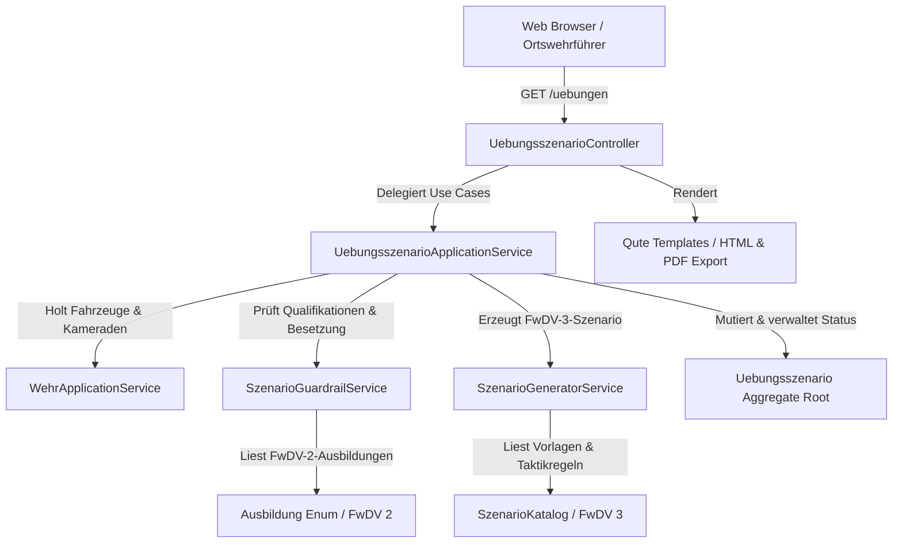

# Requirements

### Overview & Goals
Ziel ist die vollständige Umsetzung des Use Cases **UC-001: Einsatzszenario für Übungsdienst generieren** gemäß der Spezifikation [uebungsszenario.md](air-file://snpojiod4krhmm4aipea/Users/konrad/Sourcecode/ortswehrfuehrer/spec/uebungsszenario.md?type=file&root=%252F) auf Basis der **Feuerwehr-Dienstvorschrift 3 (FwDV 3: Einheiten im Lösch- und Hilfeleistungseinsatz)** ([fwdv_3.pdf](air-file://snpojiod4krhmm4aipea/Users/konrad/Sourcecode/ortswehrfuehrer/spec/fwdv_3.pdf?type=file&root=%252F)) und der **Feuerwehr-Dienstvorschrift 2 (FwDV 2: Ausbildung der Freiwilligen Feuerwehren)** ([fwdv_2.pdf](air-file://snpojiod4krhmm4aipea/Users/konrad/Sourcecode/ortswehrfuehrer/spec/fwdv_2.pdf?type=file&root=%252F)).

Der Ortswehrführer (bzw. Übungsleiter) soll in unter 5 Minuten ein realistisches, taktisch fundiertes, auf die aktuell verfügbaren Fahrzeuge, Kräfte und Qualifikationen maßgeschneidertes Übungsszenario erstellen, abschnittsweise anpassen, freigeben und als Übungsunterlage exportieren können.

### Scope

- **In Scope:**
  - Auswahl der Übungsart: **Löschübung** (Löschangriff / Brandbekämpfung) oder **Technische Hilfeleistung (TH)**.
  - Fahrzeugauswahl aus dem Fahrzeugbestand der Wehr ([Einsatzfahrzeug.java](air-file://snpojiod4krhmm4aipea/Users/konrad/Sourcecode/ortswehrfuehrer/src/main/java/de/eichstaedt/ortswehrfuehrer/domain/Einsatzfahrzeug.java?type=file&root=%252F)).
  - Besetzungszuordnung von Kameraden ([Kamerad.java](air-file://snpojiod4krhmm4aipea/Users/konrad/Sourcecode/ortswehrfuehrer/src/main/java/de/eichstaedt/ortswehrfuehrer/domain/Kamerad.java?type=file&root=%252F)) zu taktischen Funktionen nach FwDV 3 (Selbstständiger Trupp 1/2/3, Staffel 1/5/6, Gruppe 1/8/9).
  - Taktische und sicherheitsbezogene Guardrail-Prüfung gegen [Ausbildung.java](air-file://snpojiod4krhmm4aipea/Users/konrad/Sourcecode/ortswehrfuehrer/src/main/java/de/eichstaedt/ortswehrfuehrer/domain/Ausbildung.java?type=file&root=%252F) (z. B. Führungskraft, Maschinist, Atemschutzgeräteträger für Innenangriff inkl. Sicherheitstrupp, TH-Beladung).
  - Konfiguration optionaler Rahmenwerte (Dauer, Schwierigkeitsgrad, Tageszeit, Objekt/Ort, Lernziele).
  - Generierung des Szenarios mit Ausgangslage, Übungszielen, Aufgabenverteilung/Befehlen nach FwDV 3 (Einheit, Auftrag, Mittel, Ziel, Weg), Lageentwicklung/Einspielungen, Bewertungspunkten und Sicherheitshinweisen (UVV / FwDV 7).
  - Interaktives Prüfen, Bearbeiten und Neugenerieren einzelner Abschnitte.
  - Freigabe durch den Ortswehrführer und Export als druckoptimierte Übungsunterlage / PDF.
- **Out of Scope:**
  - Echteinsatz-Unterstützung und Alarmierungsübermittlung an Leitstellen.
  - Anwesenheitserfassung und Dienstbuchführung für vergangene Dienste.
  - Reale Gefahrgut-/Brandbeschleuniger-Anleitungen (streng verboten nach Guardrails).

### User Stories

- **US-1 (Übungsstart & Konfiguration):** Als Ortswehrführer möchte ich eine Übungsart (Löschangriff oder TH), teilnehmende Fahrzeuge und Rahmenparameter auswählen, um die Übung auf die verfügbaren Ressourcen zuzuschneiden.
- **US-2 (Funktionszuweisung & Qualifikationsabgleich):** Als Ortswehrführer möchte ich Kameraden den Sitzplätzen und taktischen Rollen nach FwDV 3 zuweisen und sofort sehen, ob alle erforderlichen Qualifikationen (z. B. AGT, Maschinist, Gruppenführer) erfüllt sind.
- **US-3 (Szenariogenerierung):** Als Ortswehrführer möchte ich auf Knopfdruck ein vollständiges, vorschriftenkonformes Übungsszenario erhalten, das taktisch schlüssig ist und konkrete Befehle für die Trupps enthält.
- **US-4 (Abschnittsanpassung):** Als Ortswehrführer möchte ich einzelne Abschnitte (z. B. Lageentwicklung oder Übungsziele) manuell editieren oder neu generieren lassen, um spezifische Ausbildungsschwerpunkte zu setzen.
- **US-5 (Freigabe & Export):** Als Ortswehrführer möchte ich das geprüfte Szenario freigeben und als übersichtliche PDF-Übungsunterlage mit Rollenkarten und UVV-Sicherheitshinweisen ausdrucken.

### Functional Requirements & Acceptance Criteria

- **FR-1 (Übungswizard & Übungsart):**
  - **AC-1.1:** Auswahl zwischen `Löschübung` und `Technische Hilfeleistung (TH)`.
  - **AC-1.2:** Auswahl von einem oder mehreren Fahrzeugen aus dem aktiven Wehrbestand.
- **FR-2 (Besetzungsmatrix nach FwDV 3):**
  - **AC-2.1:** Automatische Erkennung der Taktischen Einheit (Gruppe = 9 Kräfte, Staffel = 6 Kräfte, Trupp = 3 Kräfte) anhand des gewählten Fahrzeugtyps.
  - **AC-2.2:** Zuweisung von Kameraden zu den Funktionen: *Einheitsführer (GF/StF/TF)*, *Maschinist*, *Melder*, *Angriffstrupp (ATF/ATM)*, *Wassertrupp (WTF/WTM)*, *Schlauchtrupp (STF/STM)*.
  - **AC-2.3:** Anzeige vorhandener FwDV-2-Qualifikationen je Kamerad bei der Auswahl.
- **FR-3 (Guardrail- & Sicherheitsprüfung):**
  - **AC-3.1:** Mindestens 1 Kamerad mit Führungsausbildung (`GRUPPENFUEHRER` oder `TRUPPFUEHRER`) als Einheitsführer.
  - **AC-3.2:** Maschinist besitzt `MASCHINIST`-Ausbildung.
  - **AC-3.3 (Löschübung / Innenangriff):** Innenangriff erfordert mindestens 2 AGT im Angriffstrupp plus mindestens 2 AGT im Sicherheitstrupp (Wassertrupp). Bei Fehlen erfolgt Warnung mit Vorschlag für Außenangriff oder Riegelstellung.
  - **AC-3.4 (TH-Übung):** Prüfung, ob ausgewähltes Fahrzeug über TH-Ausstattung verfügt (z. B. HLF/RW mit hydraulischem Rettungssatz).
  - **AC-3.5:** Bei reduzierter Mannschaftsstärke wird automatisch ein passender Staffel- oder Trupp-Ablauf vorgeschlagen.
- **FR-4 (Szenariogenerierung & FwDV-3-Befehlsschema):**
  - **AC-4.1:** Generierung von Ausgangslage, Alarmstichwort, Einsatzobjekt, Schadenslage und Wetter/Umgebungsbedingungen.
  - **AC-4.2:** Einsatzaufträge für jeden Trupp nach dem FwDV-3-Schema: *Einheit*, *Auftrag*, *Mittel*, *Ziel*, *Weg*.
  - **AC-4.3:** Dynamische Lageentwicklung mit mindestens 2 zeitgesteuerten Einspielungen/Ereignissen.
  - **AC-4.4:** UVV-Sicherheitshinweise und Beobachtungs-/Bewertungskriterien für den Übungsleiter.
- **FR-5 (Bearbeitung & Freigabe):**
  - **AC-5.1:** Ortswehrführer kann Textabschnitte frei anpassen oder abschnittsweise neu generieren lassen.
  - **AC-5.2:** Freigabebestätigung überführt das Szenario in den Status `FREIGEGEBEN`.
- **FR-6 (Druck & PDF-Export):**
  - **AC-6.1:** Druckansicht / PDF-Export mit deutlicher Kennzeichnung "ÜBUNG" in Kopf- und Wasserzeile.
  - **AC-6.2:** Enthält Gesamtübersicht für Übungsleiter und separierbare Rollenkarten für die Trupps.

### Non-Functional Requirements

- **NFR-1 (Clean Architecture & DDD):** Strikte Trennung von Domain, Application und Web-Adapter. Domänenmodelle mit jMolecules annotiert, Value Objects als Java 21 Records.
- **NFR-2 (Leistung & Latenz):** Szenariogenerierung und Validierung erfolgen in unter 2 Sekunden.
- **NFR-3 (Datenschutz / DSGVO):** Keine Speicherung sensibler Gesundheitsdaten; exportierte Rollenkarten nutzen taktische Funktionsbezeichnungen.
- **NFR-4 (Barrierefreiheit & UI):** Konformität mit BITV 2.0 / WCAG 2.2 Stufe AA; responsives Layout für Desktop und Tablet/Mobilgeräte im Feuerwehr-Design.
- **NFR-5 (Qualität & Tests):** 100 % Konformität mit ArchUnit-Regeln; umfassende Unit- und Integrationstests für alle Golden-Set-Szenarien.

# Technical Design

### Current Implementation

- Das Projekt nutzt **Java 21**, **Quarkus 3.40** mit Qute Templates (`quarkus-rest-qute`), **jMolecules** für DDD und **ArchUnit** für Architekturprüfungen.
- Die Domäne umfasst bereits [Wehr.java](air-file://snpojiod4krhmm4aipea/Users/konrad/Sourcecode/ortswehrfuehrer/src/main/java/de/eichstaedt/ortswehrfuehrer/domain/Wehr.java?type=file&root=%252F), [Kamerad.java](air-file://snpojiod4krhmm4aipea/Users/konrad/Sourcecode/ortswehrfuehrer/src/main/java/de/eichstaedt/ortswehrfuehrer/domain/Kamerad.java?type=file&root=%252F), [Einsatzfahrzeug.java](air-file://snpojiod4krhmm4aipea/Users/konrad/Sourcecode/ortswehrfuehrer/src/main/java/de/eichstaedt/ortswehrfuehrer/domain/Einsatzfahrzeug.java?type=file&root=%252F), [Fahrzeugtyp.java](air-file://snpojiod4krhmm4aipea/Users/konrad/Sourcecode/ortswehrfuehrer/src/main/java/de/eichstaedt/ortswehrfuehrer/domain/Fahrzeugtyp.java?type=file&root=%252F) (DIN 14530) und [Ausbildung.java](air-file://snpojiod4krhmm4aipea/Users/konrad/Sourcecode/ortswehrfuehrer/src/main/java/de/eichstaedt/ortswehrfuehrer/domain/Ausbildung.java?type=file&root=%252F) (FwDV 2).
- Bislang existiert kein Modul für Übungsszenarien oder FwDV-3-Taktikstrukturen.

### Key Decisions

1. **Domänenmodellierung nach FwDV 3 & jMolecules:**
   - *Entscheidung:* Neues Aggregat `Uebungsszenario` im Domain-Package `de.eichstaedt.ortswehrfuehrer.domain.uebung`. Taktische Einheiten (`TaktischeEinheit`: Trupp, Staffel, Gruppe, Zug) und Funktionen (`TaktischeFunktion`: GF, Ma, Me, AT, WT, ST) bilden die exakte FwDV-3-Nomenklatur ab.
   - *Rationale:* Gewährleistet fachliche Korrektheit, Typsicherheit und vollständige DDD-Konformität.
2. **Entkoppelte Guardrail- & Validierungslogik (`SzenarioGuardrailService`):**
   - *Entscheidung:* Trennung von harter Validierung (Ausschlusskriterien) und weichen Hinweisen (Warnungen / Empfehlungen) in einem wiederverwendbaren Service.
   - *Rationale:* Ermöglicht flexible Rückmeldungen an den Übungsleiter im UI und automatische Alternativvorschläge (z. B. Staffel- statt Gruppenbetrieb).
3. **Deterministische und erweiterbare Szenario-Synthese-Engine (`SzenarioGeneratorService`):**
   - *Entscheidung:* Robuste regel- und katalogbasierte Generierungsengine mit FwDV-3-Befehlssynthese, strukturierten Lageentwicklungen und UVV-Sicherheitsregeln. Die Architektur wird über Interfaces für spätere KI-/LLM-Provider offengehalten.
   - *Rationale:* Garantiert 100 % vorschriftenkonforme Ergebnisse in Millisekunden, vollständige Offline-Testbarkeit und Unabhängigkeit von externen Cloud-APIs.
4. **Schrittweiser interaktiver Wizard im Web-Adapter:**
   - *Entscheidung:* Mehrstufiger Wizard mit Qute und HTMX für flüssige Statusübergänge (1. Art & Fahrzeug -> 2. Mannschaftsmatrix -> 3. Parameter -> 4. Generierung/Editierung -> 5. Freigabe & Export).
   - *Rationale:* Beste Usability für Ortswehrführer auch auf mobilen Endgeräten im Gerätehaus kurz vor Übungsbeginn.

### Data Models & Contracts

```java
package de.eichstaedt.ortswehrfuehrer.domain.uebung;

public enum Uebungsart {
  LOESCHUEBUNG("Löschübung (Brandbekämpfung)"),
  TECHNISCHE_HILFELEISTUNG("Technische Hilfeleistung (TH)");

  private final String bezeichnung;
  Uebungsart(String bezeichnung) { this.bezeichnung = bezeichnung; }
  public String getBezeichnung() { return bezeichnung; }
}

public enum TaktischeEinheit {
  SELBSTSTAENDIGER_TRUPP("Selbstständiger Trupp", "0/1/2/3", 3),
  STAFFEL("Staffel", "0/1/5/6", 6),
  GRUPPE("Gruppe", "0/1/8/9", 9),
  ZUG("Zug", "1/3/18/22", 22);

  private final String bezeichnung;
  private final String staerke;
  private final int sollStaerke;
  // Konstruktor & Getter
}

public enum TaktischeFunktion {
  EINHEITSFUEHRER("Einheitsführer / Gruppenführer", true),
  MASCHINIST("Maschinist", false),
  MELDER("Melder", false),
  ANGRIFFSTRUPPFUEHRER("Angriffstruppführer", true),
  ANGRIFFSTRUPPMANN("Angriffstruppmann", false),
  WASSERTRUPPFUEHRER("Wassertruppführer", true),
  WASSERTRUPPMANN("Wassertruppmann", false),
  SCHLAUCHTRUPPFUEHRER("Schlauchtruppführer", true),
  SCHLAUCHTRUPPMANN("Schlauchtruppmann", false);

  private final String bezeichnung;
  private final boolean fuehrungsfunktion;
  // Konstruktor & Getter
}

@ValueObject
public record FunktionsBesetzung(
    TaktischeFunktion funktion,
    String kameradId,
    String kameradName,
    Set<Ausbildung> qualifikationen
) {}

@ValueObject
public record SzenarioParameter(
    int dauerMinuten,
    Schwierigkeitsgrad schwierigkeit,
    Tageszeit tageszeit,
    String ortObjekt,
    List<String> lernziele
) {}

@ValueObject
public record Einsatzauftrag(
    String einheit,
    String auftrag,
    String mittel,
    String ziel,
    String weg
) {
  public String formatiereBefehl() {
    return String.format("%s zur %s mit %s nach/zu %s über %s vor!",
        einheit, auftrag, mittel, ziel, weg);
  }
}

@ValueObject
public record Lageentwicklung(
    int nachMinuten,
    String ereignis,
    String erwarteteMassnahme
) {}

@ValueObject
public record Sicherheitshinweis(
    String vorschrift,
    String kategorie,
    String hinweisText,
    boolean kritisch
) {}

@ValueObject
public record GuardrailPruefbericht(
    boolean gueltig,
    List<String> fehler,
    List<String> warnungen,
    List<String> empfehlungen
) {}

@AggregateRoot
public class Uebungsszenario {
  @Identity
  private String id;
  private String titel;
  private Uebungsart art;
  private Uebungsstatus status;
  private LocalDateTime erstelltAm;
  private String ersteller;
  private Set<String> fahrzeugIds;
  private TaktischeEinheit taktischeEinheit;
  private List<FunktionsBesetzung> besetzungen;
  private SzenarioParameter parameter;
  private String ausgangslage;
  private List<Einsatzauftrag> einsatzauftraege;
  private List<Lageentwicklung> lageentwicklungen;
  private List<Sicherheitshinweis> sicherheitshinweise;
  private List<String> bewertungskriterien;

  // Domain Methoden: generieren(), anpassenAbschnitt(), freigeben(), archivieren()
}
```

### Components & File Structure

```
src/main/java/de/eichstaedt/ortswehrfuehrer/
├── domain/
│   └── uebung/
│       ├── Uebungsszenario.java           (Aggregate Root)
│       ├── Uebungsart.java                (Enum)
│       ├── Uebungsstatus.java             (Enum: ENTWURF, GENERIERT, FREIGEGEBEN, ARCHIVIERT)
│       ├── TaktischeEinheit.java          (Enum nach FwDV 3)
│       ├── TaktischeFunktion.java         (Enum nach FwDV 3)
│       ├── Schwierigkeitsgrad.java        (Enum: LEICHT, MITTEL, ANSPRUCHSVOLL)
│       ├── Tageszeit.java                 (Enum: TAG, DAEMMERUNG, NACHT)
│       ├── FunktionsBesetzung.java        (Value Object Record)
│       ├── SzenarioParameter.java         (Value Object Record)
│       ├── Einsatzauftrag.java            (Value Object Record nach FwDV 3 Befehlsschema)
│       ├── Lageentwicklung.java           (Value Object Record)
│       ├── Sicherheitshinweis.java        (Value Object Record nach UVV/FwDV 7)
│       └── GuardrailPruefbericht.java     (Value Object Record)
├── application/
│   └── uebung/
│       ├── UebungsszenarioApplicationService.java (Orchestrierung Use Case UC-001)
│       ├── SzenarioGuardrailService.java          (Prüfregeln & Qualifikationsabgleich)
│       ├── SzenarioGeneratorService.java          (FwDV-3-Szenariogenerierung)
│       └── SzenarioKatalog.java                   (Fachvorlagen für Lösch- & TH-Einsatz)
└── adapter/
    └── web/
        ├── UebungsszenarioController.java         (REST / Qute Controller)
        └── dto/
            ├── SzenarioStartDto.java
            ├── BesetzungsZuweisungDto.java
            └── SzenarioAenderungDto.java

src/main/resources/templates/uebungsszenario/
├── index.html           (Übersicht aller Szenarien)
├── wizard_schritt1.html (Übungsart & Fahrzeugauswahl)
├── wizard_schritt2.html (Mannschaftszuweisung & Guardrail-Check)
├── wizard_schritt3.html (Rahmenparameter)
├── vorschau.html        (Szenario-Vorschau mit Inline-Edit & Regenerierung)
└── export_pdf.html      (Druck- & PDF-Vorlage mit Wasserzeichen "ÜBUNG")
```

### Architecture Diagram



### Risks & Mitigations

- **Risiko: Fehlende Atemschutzgeräteträger bei Gebäudebrand-Szenario.**
  - *Mitigation:* Der `SzenarioGuardrailService` erkennt das Fehlen von 4 AGTs (2 Angriffstrupp + 2 Sicherheitstrupp) sofort und schlägt automatisch eine alternative Übungslage (Außenangriff, Wasserförderung über lange Wegstrecke, Brandbekämpfung im Freien) vor.
- **Risiko: Fahrzeug verfügt nicht über erforderliche TH-Beladung.**
  - *Mitigation:* Validierung prüft den `Fahrzeugtyp` (z. B. HLF mit Rüstsatz vs. TSF ohne Hydraulik). Bei TSF werden TH-Lagen auf Basismaßnahmen (Verkehrsabsicherung, Beleuchtung, einfache technische Hilfe) begrenzt.
- **Risiko: Sicherheitsrisiko durch unrealistische oder unzulässige Übungsinhalte.**
  - *Mitigation:* Strikte Guardrails verbieten reale Gefahrgut-/Brandbeschleunigerinhalte. Alle generierten Unterlagen tragen zwingend den Header "ÜBUNG", UVV-Sicherheitshinweise werden visuell hervorgehoben und die Freigabe erfordert die explizite Bestätigung durch den Ortswehrführer (Human-in-the-Loop).

# Testing

### Validation Approach

Die Validierung erfolgt durch automatisierte Unit-Tests, ArchUnit-Architekturprüfungen sowie Integrationstests mit REST-Assured gegen die Controller-Endpunkte. Zudem werden alle vier im Lastenheft definierten **Golden-Set-Szenarien** automatisiert verifiziert.

### Key Scenarios (Golden Set)

1. **Golden Set 1 – Löschübung TSF-W mit Staffelbesatzung (6 Kräfte, wenig Atemschutz):**
   - *Eingabe:* Übungsart `LOESCHUEBUNG`, Fahrzeug `TSF-W`, Staffelbesatzung, nur 2 Kameraden mit Atemschutzausbildung.
   - *Erwartetes Verhalten:* Guardrail meldet Warnung bezüglich Innenangriff (fehlender Sicherheitstrupp) und generiert ein Außenangriffs-Szenario mit Wasserförderung und Riegelstellung gemäß FwDV 3.
2. **Golden Set 2 – TH-Übung HLF mit Gruppenbesatzung (9 Kräfte, voll qualifiziert):**
   - *Eingabe:* Übungsart `TECHNISCHE_HILFELEISTUNG`, Fahrzeug `HLF 20`, Gruppe (9 Kräfte), ausgebildeter Gruppenführer, Maschinist und TH-Kameraden.
   - *Erwartetes Verhalten:* Guardrail meldet vollständige Einsatzbereitschaft. Generierung eines Verkehrsunfalls mit eingeklemmter Person, Befehle für Absicherung, Brandschutz, Gerätebereitstellung und patientengerechte Rettung mit Schere/Spreizer.
3. **Golden Set 3 – Mehrere Fahrzeuge & Anspruchsvolles Szenario:**
   - *Eingabe:* Zwei Fahrzeuge (HLF + TLF), Tagesübung, Schwierigkeit `ANSPRUCHSVOLL`.
   - *Erwartetes Verhalten:* Koordinierte Einheitsbefehle für beide Einheiten, definierte Wasserübergabepunkte und mehrstufige Lageeinspielungen.
4. **Golden Set 4 – Zu wenig Personal / Fehlende Führungsqualifikation:**
   - *Eingabe:* Nur 4 Kräfte zugewiesen oder kein Kamerad mit `GRUPPENFUEHRER`/`TRUPPFUEHRER`-Ausbildung.
   - *Erwartetes Verhalten:* Guardrail blockiert die Generierung mit klarem Validierungsfehler und schlägt Reduzierung auf selbstständigen Trupp oder Zuweisung einer geeigneten Führungskraft vor.

### Edge Cases

- Zuweisung von Kameraden ohne Atemschutzausbildung auf die Funktion `ANGRIFFSTRUPPFUEHRER` bei Innenangriff -> Validierungsfehler mit präzisem Hinweistext.
- Manuelle Nachbearbeitung von Einsatzaufträgen -> Prüfung auf Erhalt des FwDV-3-Formats und Speicherung im Szenario-Aggregat.
- Export vor Freigabe -> Statusprüfung verhindert PDF-Druck im Entwurfsstadium oder kennzeichnet Entwurf explizit als unvollständig.

### Test Changes

- `UebungsszenarioTest`: Unit-Tests für Aggregat-Zustandsübergänge und Domänenlogik.
- `SzenarioGuardrailServiceTest`: Vollständige Abdeckung aller FwDV-2-, FwDV-3- und UVV-Prüfregeln.
- `SzenarioGeneratorServiceTest`: Überprüfung der FwDV-3-Befehlssynthese und Szenario-Inhalte.
- `UebungsszenarioControllerTest`: Web-Integrationstests für den mehrstufigen Wizard und den PDF-Export.
- `ArchitectureTest`: Sicherstellung der jMolecules-DDD-Konformität und Record-Struktur für alle neuen Value Objects.

# Delivery Steps

### ✓ Step 1: 1. Domänenmodellierung für FwDV-3-Einheiten und Übungsszenarien
Das Domänenmodell für Übungsszenarien, taktische FwDV-3-Einheiten und Besetzungsfunktionen ist vollständig als DDD-Aggregate und Value Objects (Records) implementiert.

- Erstellung des Enums `TaktischeEinheit` (`SELBSTSTAENDIGER_TRUPP`, `STAFFEL`, `GRUPPE`, `ZUG`) und `TaktischeFunktion` (`EINHEITSFUEHRER`, `MASCHINIST`, `MELDER`, `ANGRIFFSTRUPPFUEHRER`, `ANGRIFFSTRUPPMANN`, `WASSERTRUPPFUEHRER`, `WASSERTRUPPMANN`, `SCHLAUCHTRUPPFUEHRER`, `SCHLAUCHTRUPPMANN`) gemäß [fwdv_3.pdf](air-file://snpojiod4krhmm4aipea/Users/konrad/Sourcecode/ortswehrfuehrer/spec/fwdv_3.pdf?type=file&root=%252F).
- Implementierung des Aggregat-Roots `Uebungsszenario` (mit `@AggregateRoot`, `@Identity`, Status `ENTWURF`, `GENERIERT`, `FREIGEGEBEN`, `ARCHIVIERT`).
- Implementierung der Value Objects als Java-Records (`FunktionsBesetzung`, `SzenarioParameter`, `Einsatzauftrag`, `Lageentwicklung`, `Sicherheitshinweis`, `Bewertungspunkt`).
- Bereitstellung von Domänen-Unit-Tests und Validierung gegen die ArchUnit-Regeln in [ArchitectureTest.java](air-file://snpojiod4krhmm4aipea/Users/konrad/Sourcecode/ortswehrfuehrer/src/test/java/de/eichstaedt/ortswehrfuehrer/ArchitectureTest.java?type=file&root=%252F).

### ✓ Step 2: 2. Guardrail- und Qualifikations-Validierungsengine
Die Validierungs- und Guardrail-Engine prüft Fahrzeugbesatzungen und Qualifikationen zuverlässig gegen die Vorgaben aus FwDV 2, FwDV 3 und Unfallverhütungsvorschriften.

- Implementierung des `SzenarioGuardrailService` zur Überprüfung harter Ausschlusskriterien und weicher Warnungen gemäß Abschnitt 8.3 aus [uebungsszenario.md](air-file://snpojiod4krhmm4aipea/Users/konrad/Sourcecode/ortswehrfuehrer/spec/uebungsszenario.md?type=file&root=%252F).
- Prüfung auf mindestens eine qualifizierte Führungskraft (`GRUPPENFUEHRER` bzw. `TRUPPFUEHRER`) und Maschinistenqualifikation (`MASCHINIST`).
- Prüfung auf Atemschutz-Guardrails für Innenangriffe (mind. 2 AGT im Angriffstrupp plus 2 AGT im Sicherheitstrupp/Wassertrupp).
- Prüfung der technischen Fahrzeug-Beladung (z. B. Rüstsatz/Hydraulikgerät bei Technischer Hilfeleistung).
- Implementierung umfassender Tests für alle Guardrail-Regeln und Warnmeldungen.

### ✓ Step 3: 3. Szenario-Generierungsengine nach FwDV 3
Die Generierungs-Engine erzeugt realistische, strukturierte und FwDV-3-konforme Einsatzszenarien für Löscheinsätze und Technische Hilfeleistungen.

- Implementierung des `SzenarioGeneratorService` mit hinterlegtem Fachkatalog (`SzenarioKatalog`) für Löschangriff (z. B. Gebäudebrand, Zimmerbrand, Wald-/Flächenbrand) und Technische Hilfeleistung (z. B. VU eingeklemmte Person, Sturmschaden, Notfalltüröffnung).
- Strukturierte Synthese von Ausgangslage, taktischen Zielen, Einsatzaufträgen nach dem FwDV-3-Befehlsschema (Einheit, Auftrag, Mittel, Ziel, Weg), Lageentwicklung/Einspielungen und UVV-Sicherheitshinweisen.
- Berücksichtigung der konfigurierbaren Parameter (Dauer, Schwierigkeitsgrad, Tageszeit, Objekt, Lernziele) und dynamische Anpassung an die Besetzungsstärke (Staffel vs. Gruppe).
- Integration von Unit-Tests für alle Golden-Set-Szenarien aus [uebungsszenario.md](air-file://snpojiod4krhmm4aipea/Users/konrad/Sourcecode/ortswehrfuehrer/spec/uebungsszenario.md?type=file&root=%252F).

### ✓ Step 4: 4. Application Service und Workflow-Orchestrierung
Der Application Service steuert den gesamten Lebenszyklus eines Szenarios von der Konfiguration über Anpassungen bis zur Freigabe durch den Ortswehrführer.

- Erstellung des `UebungsszenarioApplicationService` mit Methoden zur Initialisierung eines Entwurfs, Besetzungszuweisung, Guardrail-Prüfung, Generierung, abschnittsweisen Modifikation und Freigabe.
- Integration mit dem bestehenden [WehrApplicationService.java](air-file://snpojiod4krhmm4aipea/Users/konrad/Sourcecode/ortswehrfuehrer/src/main/java/de/eichstaedt/ortswehrfuehrer/application/WehrApplicationService.java?type=file&root=%252F) zur Abfrage verfügbarer Einsatzfahrzeuge und Kameraden samt FwDV-2-Ausbildungen.
- Implementierung von Bearbeitungs- und Regenerierungsfunktionen für einzelne Abschnitte (z. B. Lageentwicklung neu würfeln/generieren).
- Unit- und Integrationstests für den Application Service.

### ✓ Step 5: 5. Web-Wizard und interaktive Benutzeroberfläche
Ein barrierefreier, mehrstufiger Web-Wizard führt den Ortswehrführer intuitiv durch die Erstellung, Prüfung und Freigabe des Übungsszenarios.

- Implementierung des `UebungsszenarioController` mit REST-Endpunkten für Wizard-Schritte (Übungsart, Fahrzeugauswahl, Mannschaftszuweisung, Parameter, Vorschau/Bearbeitung, Freigabe).
- Erstellung der Quarkus-Qute-Templates (`uebungsszenario/wizard.html`, `uebungsszenario/besatzung.html`, `uebungsszenario/vorschau.html`, `uebungsszenario/liste.html`) im Feuerwehr-Design unter Nutzung von Bootstrap 5 und HTMX.
- Integration von Hinweisen, Warnungen und visueller Funktionsmatrix für Atemschutz- und Maschinistenstatus.
- Barrierefreie Gestaltung nach BITV 2.0 / WCAG 2.2 AA (ARIA-Attribute, Tastaturbedienbarkeit, semantische Formulare).
- Integrationstests mit REST-Assured für alle Controller-Routen.

### ✓ Step 6: 6. PDF-Export und druckbare Übungsunterlagen
Die freigegebene Übungsunterlage kann als druckoptimiertes Dokument sowie als PDF exportiert werden und enthält alle Sicherheits- und Rollenhinweise.

- Erstellung des Druck- und Export-Templates mit klarer visueller Kennzeichnung als "ÜBUNG" (Wasserzeichen/Header) und Hervorhebung sicherheitsrelevanter UVV-Hinweise.
- Implementierung des PDF- bzw. Print-View-Endpunkts (`/uebungen/{id}/export/pdf` bzw. Druckansicht).
- Bereitstellung einer kompakten Übersicht für den Übungsleiter sowie rollenspezifischer Einweisungskarten für die Trupps (AT, WT, ST, Ma, Me).
- Validierung des Exports und Integration in die Dashboard-Navigation in [base.html](air-file://snpojiod4krhmm4aipea/Users/konrad/Sourcecode/ortswehrfuehrer/src/main/resources/templates/base.html?type=file&root=%252F).